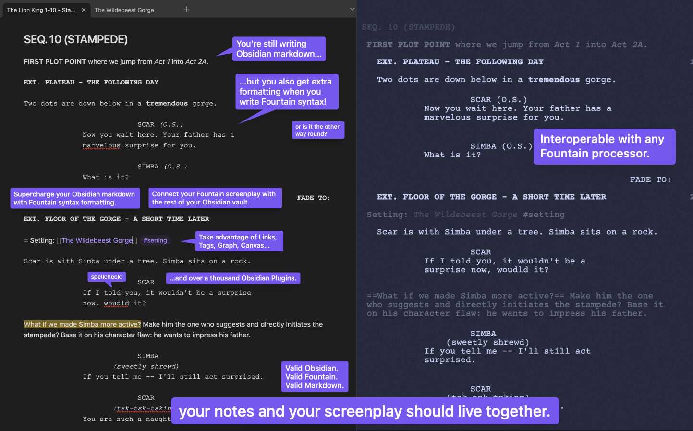

# Obsidian Fountain - Live Editor

|**Obsidian Live Preview styling for the [Fountain](https://fountain.io) screenplay language syntax.**|
|-|

")

---

## Usage

Currently in beta, you may use [BRAT](https://github.com/TfTHacker/obsidian42-brat) to install it! This plugin should only extend your view and should never modify any local files, but to be safe, only install on test vaults until we reach a stable 1.0.0!

Open any file and type away: you will get automatic formatting according to the [Fountain syntax rules](https://fountain.io/syntax/)!

> **Youtube Demo**: [Obsidian Fountain - Live Editor (Plugin Showcase)](https://youtu.be/GORryaw32sI)

---

## Design Guidelines

### Interoperable

Obsidian-flavored Markdown plays quite well with Fountain syntax, generally. But we need to define some rules for those overlapping areas.

<!-- The penultimate concern is interoperability between Obsidian Markdown syntax and Fountain screenplay syntax. -->
1. **Fountain-compliant**: The final document must be *100% compatible with Fountain* processors and exporters.
  1a. **Formatting parity**: The final processed document, especially the actual Fountain parts (that is, not the escaped synopsis or boneyard sections), should look as similar to the rendered Live Preview formatting as possible.
2. **Fountain-first**: A *Fountain-first user*, who has no previous concept of Obsidian or Markdown, should be able to write a full Fountain document with 0 friction, as if in a professional live editor.
3. **Obsidian-second**: An *Obsidian-first user* may be allowed to lose/forfeit their usual/familiar Obsidian syntax **IF** it conflicts with standard Fountain syntax.

There are two obvious cases of formatting conflict.

| Formatting | Markdown |   Fountain |
| -- | -- | -- |
| Line begins with `>` | [blockquote](https://help.obsidian.md/Editing+and+formatting/Basic+formatting+syntax#Quotes) | [Centered Text](https://fountain.io/syntax/#centered-text) & forced [Transition](https://fountain.io/syntax/#transition) |
| Inline text wrapped in `_` | [italic](https://help.obsidian.md/Editing+and+formatting/Basic+formatting+syntax#Styling+text) | [Underline (Emphasis)](https://fountain.io/syntax/#emphasis) |

In both these cases, we should favor the Fountain formatting over the Markdown formatting. That means, no more italics with underscores, and no more blockquotes. *(Implementation is WIP, it half-works now)*

### Parallel

There's conflict, but we can have both. **Fountain-formatted notes should live in parallel with regular Obsidian Markdown notes.**

We should be able to mark/define certain files to be Fountain-formatted, or to define some glob pattern for a group of files. *(This is completely WIP)*

Then, Obsidian note-making is business as usual, until we come across a file that is marked for Fountain-formatting. That is the scope that this plugin will operate in.

### Scoped

This plugin should do [one thing well](https://en.wikipedia.org/wiki/Unix_philosophy). That one thing is to add Live Editor styling for the Fountain syntax to Obsidian.

That said, there are a LOT of tools that can fill obvious missing steps in your pipeline.

#### Recommended Tools

- [Better Fountain - Visual Studio Code Extension](https://marketplace.visualstudio.com/items?itemName=piersdeseilligny.betterfountain): *Fountain autocomplete, syntax highlighting, and export to PDF*
  - **Fountain writing in VS Code!**
  - It's what I've been using before this, what I will continue to use for its:
    1. Export to PDF!
    2. Live Preview!
    3. Screenplay statistics!
    4. Repository management, like handling `git`. Obsidian will still use `git`.
    5. Writing Fountain directly. It's still a great UX that I will still use.
  - That said,
    1. I want links to integrate with my Obsidian vault.
    2. Since Fountain is meant to be written in one long document, it gets bulky. Which leads us to...
- [kevboh/longform](https://github.com/kevboh/longform): *A plugin for Obsidian that helps you write and edit novels, screenplays, and other long projects.*
  - **Manage and compile notes into an ordered manuscript!**
  - Yes! This means you can write Fountain in separate files! And sequence them!
- [MeepTech/obsidian-custom-file-extensions-plugin](https://github.com/MeepTech/obsidian-custom-file-extensions-plugin): *An obsidian plugin allowing you to register and view different file extensions in a modular manner.*
  - Allows you to open `.fountain` files in the Obsidian editor!
  - Fountain syntax formatting works!
  - But `.fountain` files will not be linked in the editor.

See [Related Projects](#related-projects) for more!

---

## Contributing

### Overview

#### Don't know how to code? You can contribute

- 🪲 **Report bugs/request features** on the Issue tab!
- 📣 **Share (the link to) this plugin** around on forums and channels and with your friends! Raise awareness!
- 💬 **Message me** (@chuangcaleb) on Discord!
  - 🪲 Report a bug!
  - ⚡️ Request a feature!
  - 🤩 Send words of encouragement! They actually make a difference.
- ✍🏼 **Create a screenplay project** integrated with Obsidian!
  - 📸 **Showcase examples** of how you took advantage of mixing the best of Fountain + Obsidian. Then I can reuse your examples in promotions, and maybe get inspiration too! hehe

#### Know how to code? You can contribute

- 🔀 **Open a Pull Request!** *Focus on critical bugs and major features first.*
  - 🏗️ I may need some help setting up infrastructure stuff like automation!
- 🪲 **Report a bug**, but with your *specialized technical diagnosis*!
- 🫱 **Send some advice**, Not just a first-time Obsidian plugin dev, but my first public community project.

## Related Projects

- [Darakah/obsidian-fountain](https://github.com/Darakah/obsidian-fountain): *Obsidian plugin to edit, write and render Fountain Writing Syntax for screenplays and scripts*
  - Formats Fountain syntax, just like this plugin
  - But for preview mode only, and must be wrapped in a code block
  - 2.5 years+ old project
- [chuangcaleb/ffluent](https://github.com/chuangcaleb/ffluent): CLI to bundle atomic Fountain screenplay files
  - My attempt to replicate `longform` but for Fountain files, as a CLI. Uses a json/yaml file at each directory to define a sequence.
  - Abandoned since this project, but may be of interest.
- [Highland 2](https://www.highland2.app/)
  - Made by the creator of Fountain itself. Features its own text editor app, WYSIWYG, "Revision Mode" and analysis tools. Since everything is wrapped in a nice bow, it's probably the best Fountain-writing app if you're not technical.
